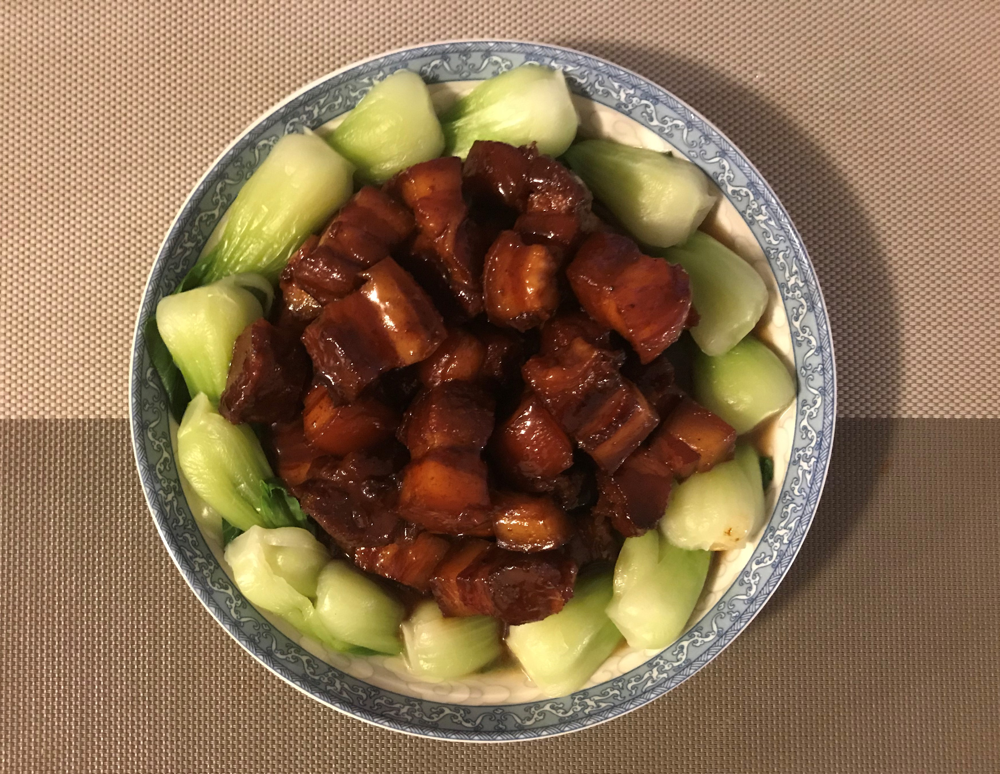
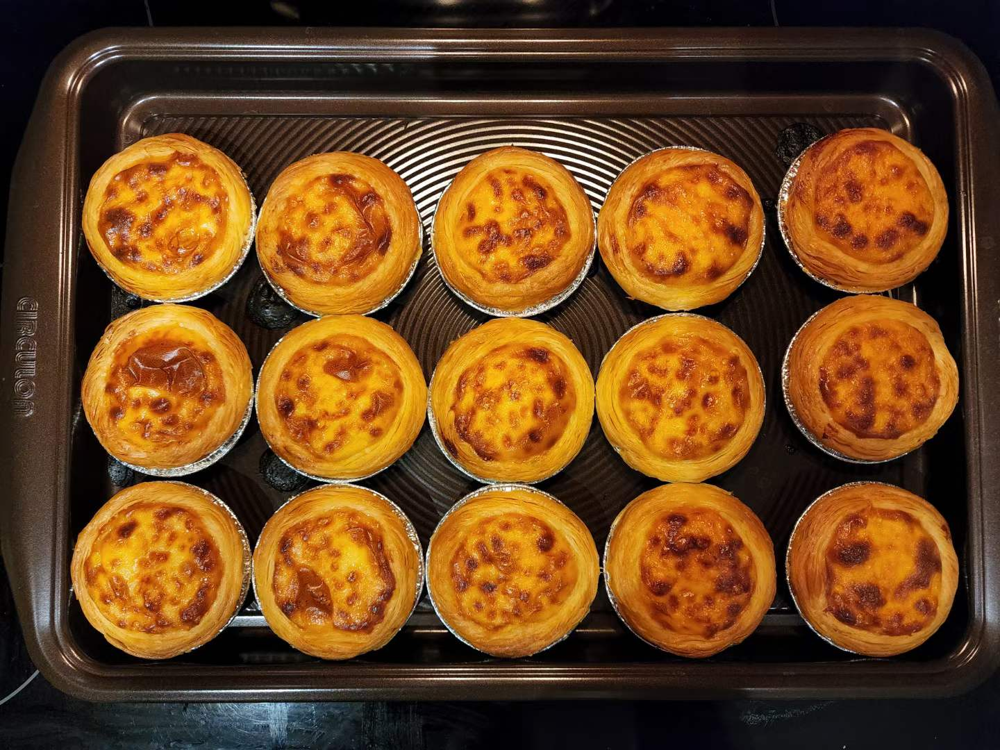
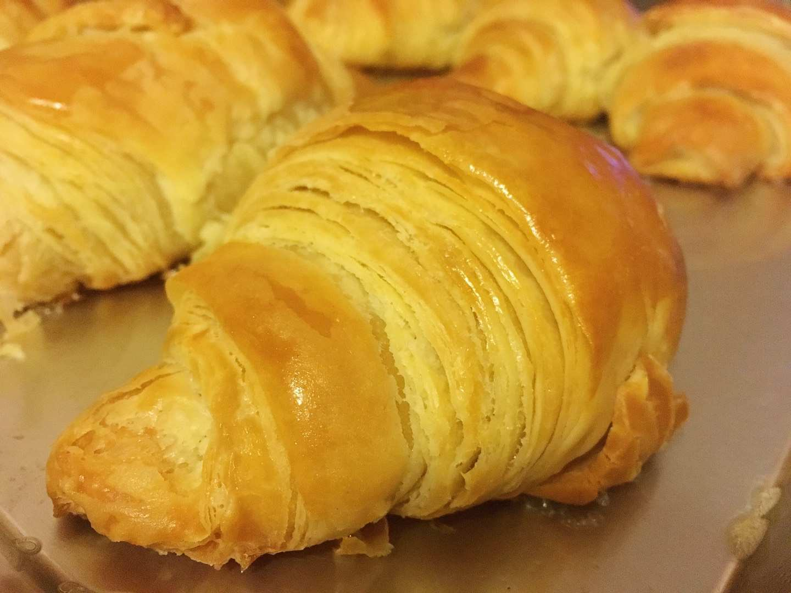
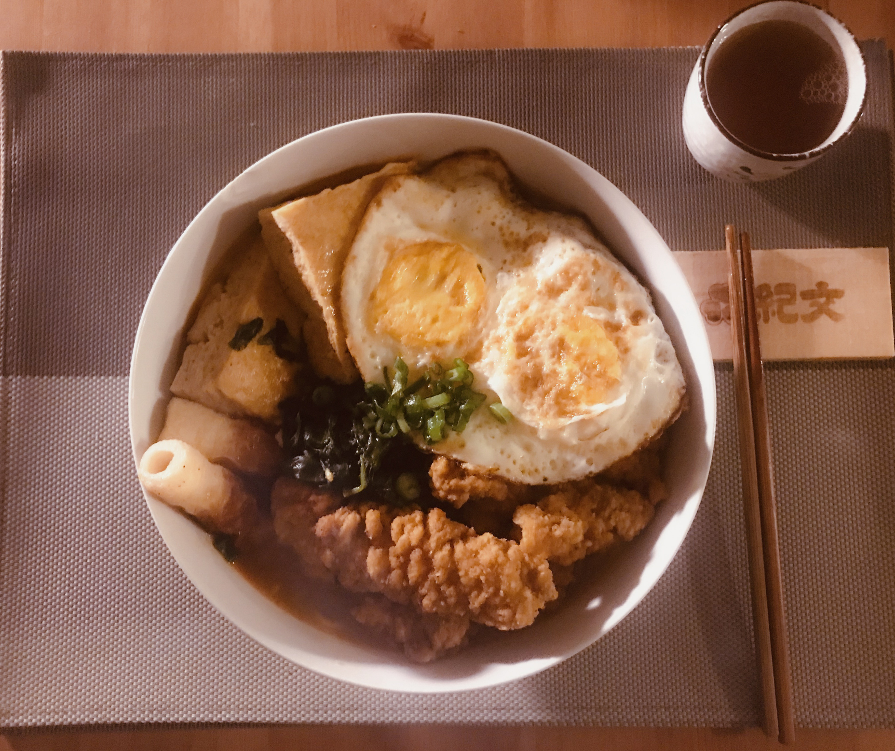

```{r setup, include=FALSE}
knitr::opts_chunk$set(echo = TRUE)
```
This website contains a short introduction of Vincent Jin.

# Self Introduction
## Background

```{r Background, echo = FALSE}
cat("Hi! My name is Vincent Jin and I am a second year MHS student from the Department of Epidemiology, Infectious Disease track.")

cat("I completed my bachelor's degree from Unviersity of Washington with a major of Public Health in 2019. Before I came to Hopkins, I worked as a social worker who helps senior low-English-literacy Asian immigrants access governmental healthcare programs in Seattle, WA for about 1 and a half year.")

cat("My current research interest lies upon the COVID-19 pandemic. \nI am currently doing a survival analysis to try explore the association between prior COVID-19 infections before vaccination and breakthrough infections after being fully vaccinated.")

cat("I do not have much experiences with coding and do not know much about R. Before this course, I was mainly using Stata on data analysis. I also do not have very strong statistical background, but I think I'll be able to satisfy the requirements of this course that were described in Lecture 01. By taking this course, I wish to familiarize myself with R so that I'll be having more options when doing data analysis in the future, and also expand my capability of collaboration with colleagues who only use R.")

cat("Thank you so much for this course, Dr. Hicks! I have already learned a lot by doing the Project 0. Looking forward to hear more about R and Statistical Computing!")
```

## Five Fun Facts About Me
### 1. I love cook! Here are some pictures:
<br>
Braised Pork
<br>
{width=50% height=50%} 
<br>
<br>
Egg Tarts
<br>
{width=50% height=50%} 
<br>
<br>
Mooncakes
<br>
{width=50% height=50%} 
<br>
<br>
Croissant
<br>
{width=50% height=50%}
<br>
<br>
Noodle Soup
<br>
{width=50% height=50%}

### 2. I love cats but I do not have a cat.

### 3. I am actually from Wuhan, China, and that is why I have a research interest of COVID-19.

### 4. Part of my leagal name is a combination of the pronunciation of my father's last name and my mother's last name.

### 5. My favorite ice cream flavor is vanilla.

## The link I found interesting:

### Check this link for my favorite Bossa Nova song from Shibata Jun
### https://www.youtube.com/watch?v=dQw4w9WgXcQ
``` {r sameta, echo = FALSE}
library("vembedr")
embed_url("https://www.youtube.com/watch?v=PIHKMcvLBhU")
```

```{css, echo=FALSE}
.spoiler {
  visibility: hidden;
}

.spoiler::before {
  visibility: visible;
  content: "If you have clicked on the link: Please move your cursor here."
}

.spoiler:hover {
  visibility: visible;
}

.spoiler:hover::before {
  display: none;
}
```
[Sorry the link was rickrolling - but I really like that song as well! Hope you enjoyed it! :)]{.spoiler}
 


